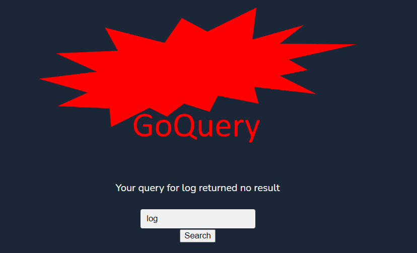
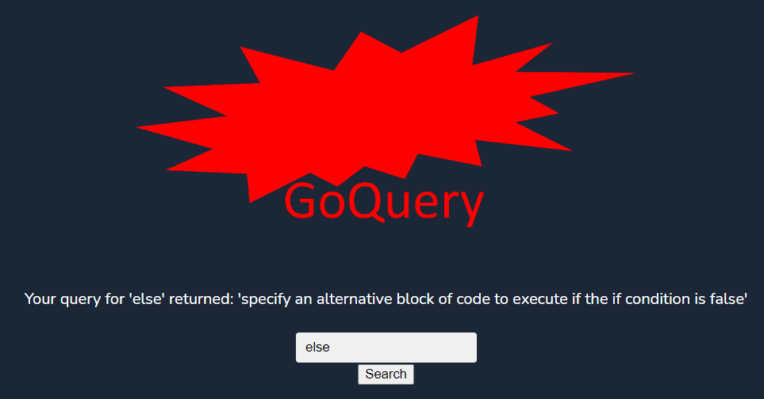

## Part 1 - README_from_Wails
### About
This is the official Wails Svelte template.
## Live Development
To run in live development mode, run `wails dev` in the project directory. This will run a Vite development
server that will provide very fast hot reload of your frontend changes. If you want to develop in a browser
and have access to your Go methods, there is also a dev server that runs on http://localhost:34115. Connect
to this in your browser, and you can call your Go code from devtools.
## Building
To build a redistributable, production mode package, use `wails build`.

## Part 2 - README_for Assignment W9
### About 
This Golang-based repo uses a QandA.db database file from https://github.com/ThomasWMiller/jump-start-sqlite, which can be modified such as by insertion. Through modifying app.go and app.svelte, the project allows the query of a term (question) for a matched answer in the database. If the result is empty, it will state "returned no result". The app_test.go test file (OK'ed) was based on the query of a newly inserted term 'default'.

### Usage 
The relative path is based on the entire repo as the working directory, with the QandA.db file in the db folder. The .exe file is in the build/bin folder. The user needs to enter the query term in the window and then click "Search". The result (e.g., for 'else') in case of a match in the database will be shown as "Your query for 'else' returned: 'specify an alternative block of code to execute if the if condition is false'". If no match is found, it will show (e.g., for 'log') "Your query for log returned no result".

### Future Development
The insertion/update should have been separated from the query functions. The advanced search based on cosine similarity, etc., should be considered in the future database design and query.

